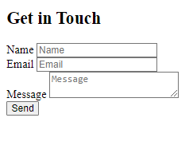

## 1. Raw Problem

Create the ‘Get in Touch’ Form for your portfolio which should include the following:

1. Name input section (an input of text type)

2. Email input section (an input of email type)

3. Message input section (a textarea)

4. and a submit button (an input of submit type)

Further, refer to the test cases to understand necessary requirements to submit the problem.

Below is the basic structure of the expected output:

## 2. Raw Problem
Create a basic HTML webpage that displays 2 list. One ordered, one unordered.
Ordered List should contain a list of 5 cities from around the world. Use alphabets numbers for list-item marker.
Unordered List should contain a list of 3 beverages. Use square for list-item marker.

## 3. Raw Problem
Create a basic HTML webpage that displays a table like the one shown below:

