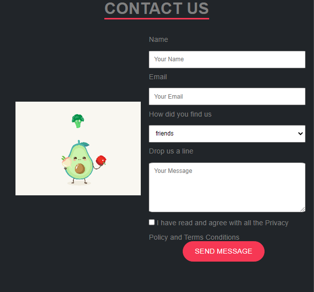
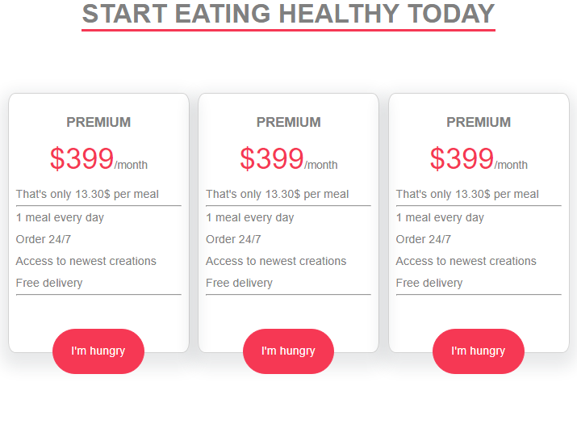

## Raw Problem - 1
The goal of this problem is to use CSS Flexbox to create a flexible layout for a webpage.

Make sure to set the:

1. the direction of the main axis to 'row'

2. the alignment along the main axis to the 'center'

3. the alignment along the cross-axis to the 'center'

4. and enable the wrapping of items.

Further, refer to the test cases to understand necessary requirements to submit the problem.

The end result should look like the following:

Solution : 1.html

## Raw Problem - 2

Write internal CSS and determine flexbox properties of the Contact Us form.

You are given HTML and some preset CSS as boilerplate.

In HTML:
1. section.contact-form-section contains:
1.1. h2 element with content 'CONTACT US'
1.2. div.container_parent
2. div.container_parent element contains:
2.1. img element
2.2. form element

The output should look like this:

To achieve this you need to utilise Flexbox properties in the following manner.

For section.contact-form-section:
1. Set the display to flex
2. Set the main axis of flex as y-axis (column)
3. Align the items to center on the cross-axis

For div.container_parent:
1. Set the display to flex
2. And position the children elements across horizontal axis to 'space-evenly'

Sol: 2.html

## Raw Problem - 3

Write internal CSS and determine flexbox properties of the Pricing Cards.

You are given HTML and some preset CSS as boilerplate.

In HTML:
1. section contains:
1.1. h2 element with section heading
1.2. div.cards-container
2. div.cards-container element contains:
2.1. 3 div.card elements

The output should look like this:

To achieve this you need to utilise Flexbox properties in the following manner.

For section:
1. Set the display to flex
2. Set the main axis of flex as y-axis (column)
3. Align the items to center on the cross-axis

For div.cards-container:
1. Set the display to flex
2. And position the children elements across horizontal axis to 'space-evenly'

Additionally, you set flex-wrap property with value 'wrap' for div.cards-container to make the section responsive.

## Raw Problem - 4

Write internal CSS and determine flexbox properties of the Navbar.

You are given HTML and some preset CSS as boilerplate.

In HTML:
1. <header> includes <nav>
2. <nav> contains list of anchor tags linked to several sections of the webpage
Don't change any of the boilerplate code.

The output should look like this:

To achieve this you need to utilise Flexbox properties in the following manner.

For ul.navigation:
1. Set the display to flex
2. And position the <li> across horizontal axis to 'flex-end'

## Raw Problem - 5

Write internal CSS and determine flexbox properties of the Footer.

You are given HTML and some preset CSS as boilerplate.

In HTML:
1. footer contains:
1.1. div.footer-parent element.
1.2. p.footer-p element containing copyright info.
2. div.footer-parent element contains:
2.1. ul.footer-text -> contains redirectable links
2.2. ul.social-link -> contains social media logos inscribed in links

The output should look like this:

To achieve this you need to utilise Flexbox properties in the following manner.

For div.footer-parent:
1. Set the display to flex
2. And position the children elements across horizontal axis to 'space-between'

For ul.footer-text:
1. Set the display to flex
2. And position the children elements across horizontal axis to 'start'

For ul.social-link:
1. Set the display to flex
2. And position the children elements across horizontal axis to 'end'
