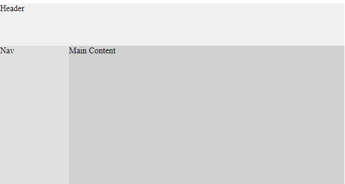
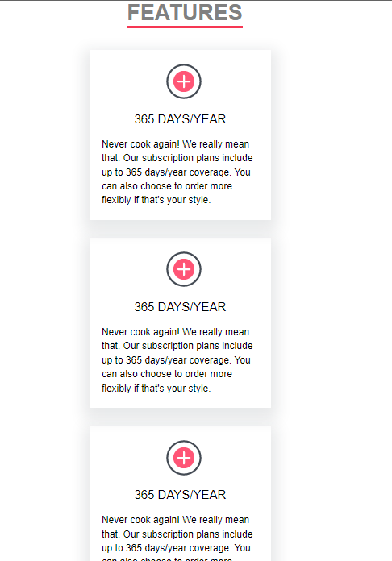
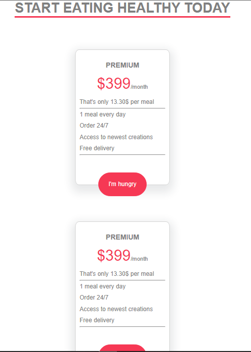
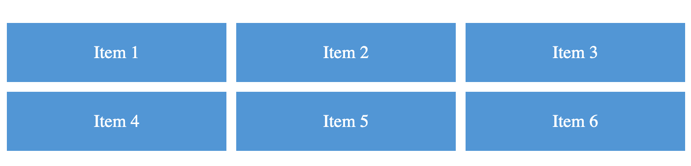

## Raw Problem - 1
You are given a web page design that needs to be implemented using CSS Grid.

The design contains:
a header,
a navigation menu,
a main content area,
and a footer.

Further, refer to the test cases to understand necessary requirements to submit the problem.

Below is a basic look of the expected output:

## Raw Problem - 2

Create a Pinterest-like layout using HTML and CSS, without using images, but only using simple boxes with different colors.
Use CSS Grid to create the layout.
The layout should have a responsive design and adapt to different screen sizes.

Utilize the variable values provided in boilerplate CSS.

Further, refer to the test cases to understand necessary requirements to submit the problem.
Below is a basic look of the expected output:

## Raw Problem - 3

Write internal CSS to make the features section responsive

You are given HTML and some preset CSS as boilerplate.
In HTML:
1. section.features contains:
1.1. h1 element
1.2. div.container-parent
2. div.container-parent contains: (display set as flex)
2.2. 3 div.containter elements that are the feature cards.

The output should look like this:

To achieve this you need to utilise media query in the following manner.

Add a media query for screens smaller than 940px, in which:
1. Using flex-direction, change the main-axis of the div.container-parent to y-axis
2. In the div.container-parent, align the items across cross-axis to center.

Note: smaller than 940px will have max-width set to 939px

## Raw Problem - 4

Write internal CSS to make the Pricings section responsive

You are given HTML and some preset CSS as boilerplate.

In HTML:
1. section contains:
1.1. h2 element
1.2. div.cards-container
2. div.cards-container contains: (display set as flex)
2.2. 3 div.card elements that are the pricing cards.

The output should look like this:

To achieve this you need to utilise media query in the following manner.

Add a media query for screens smaller than 768px, in which:
1. Using flex-direction, change the main-axis of the div.cards-container to y-axis.
2. In the div.cards-container, align the items across cross-axis to center.

Note: smaller than 768px will have max-width set to 767px

## Raw Problem - 5

You are tasked with creating a simple 3x3 grid layout using CSS Grid.
Below, you'll find the initial HTML structure and the CSS requirements to achieve
this grid layout.

CSS Requirements:
1. Create a simple 3x3 grid layout using CSS Grid for the elements within the .grid container.
2. Use appropriate CSS Grid properties to achieve the desired grid structure.
3. Ensure that there is equal spacing between grid items of 10px

Refer to the below image to see what is the end state we want to reach.

